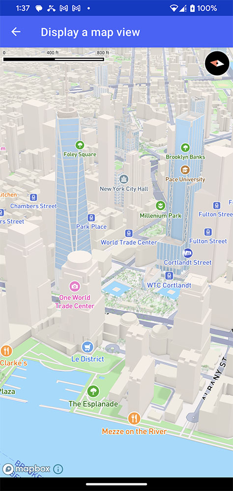
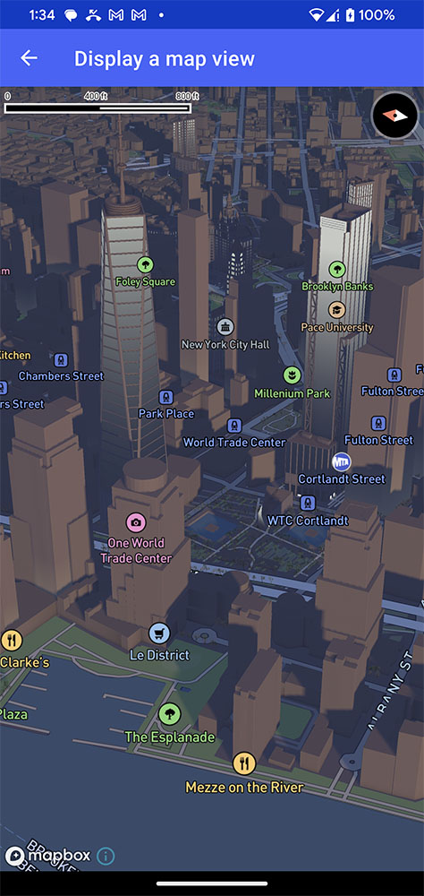

# Mapbox Maps SDK v11 for Android Migration Guide <!-- omit in toc -->

This document is a guide for migrating from v10 of the Mapbox Maps SDK for Android to the v11. It includes information about new features, deprecated APIs, and breaking changes.

## Explore This Guide <!-- omit in toc -->

- [Version Compatibility](#version-compatibility)
- [Explore new features](#explore-new-features)
  - [The Mapbox Standard Style](#the-mapbox-standard-style)
  - [Style Imports](#style-imports)
- [Migration steps](#migration-steps)
  - [1. Update dependencies](#1-update-dependencies)
  - [2. Replace deprecated APIs](#2-replace-deprecated-apis)
    - [2.1 Deprecating MapboxMap.loadStyle methods](#21-deprecating-mapboxmaploadstyle-methods)
    - [2.2 Deprecating event listener APIs](#22-deprecating-event-listener-apis)
    - [2.3 Image utilities](#23-image-utilities)
  - [3. Check for breaking changes](#3-check-for-breaking-changes)
    - [3.1 Location API](#31-location-api)
      - [3.1.1 Using LocationService instead of LocationEngine](#311-using-locationservice-instead-of-locationengine)
    - [3.2. ResourceOptions and ResourceOptionsManager have been removed](#32-resourceoptions-and-resourceoptionsmanager-have-been-removed)
    - [3.3 Events API](#33-events-api)
    - [3.4 Camera Animations API](#34-camera-animations-api)
    - [3.5 Annotation API](#35-annotation-api)
    - [3.6 Offline API](#36-offline-api)
      - [3.6.1 OfflineManager API changes](#361-offlinemanager-api-changes)
      - [3.6.2 Legacy OfflineRegionManager API changes](#362-legacy-offlineregionmanager-api-changes)
    - [3.7 Query Rendered/Source Features API](#37-query-renderedsource-features-api)
    - [3.8 Feature State API](#38-feature-state-api)
    - [3.9 Snapshot API](#39-snapshot-api)
    - [3.10 Style API](#310-style-api)
    - [3.11 Render Cache API](#311-render-cache-api)
    - [3.12 Attributes API](#312-attributes-api)
    - [3.13 Usage of data classes](#313-usage-of-data-classes)
    - [3.14 Usage of interfaces](#314-usage-of-interfaces)
    - [3.15 Changes in the network stack](#315-changes-in-the-network-stack)
    - [3.16 Java-specific changes](#316-java-specific-changes)
    - [3.17 Settings service changes](#317-settings-service-changes)
    - [3.18 Kotlin-specific changes](#318-kotlin-specific-changes)
    - [3.19 Plugin changes](#319-plugin-changes)
    - [3.20 View annotations](#320-view-annotations)
  - [4. Validate ProGuard Rules](#4-validate-proguard-rules)
  - [5. Test your app](#5-test-your-app)
- [New APIs and minor ergonomic improvements](#new-apis-and-minor-ergonomic-improvements)
  - [Lighting and 3D Model APIs](#lighting-and-3d-model-apis)
    - [Lighting API](#lighting-api)
    - [Layer emissiveness controls](#layer-emissiveness-controls)
    - [New FillExtrusionLayer properties](#new-fillextrusionlayer-properties)
    - [LineLayer occlusion visibility](#linelayer-occlusion-visibility)
    - [Icon cross-fading for the SymbolLayer](#icon-cross-fading-for-the-symbollayer)
    - [ModelLayer](#modellayer)
  - [Jetpack Compose Extension](#jetpack-compose-extension)
  - [Query Rendered Features and Feature State API improvements](#query-rendered-features-and-feature-state-api-improvements)
  - [Camera API improvements](#camera-api-improvements)
  - [Style API and expressions improvements](#style-api-and-expressions-improvements)
    - [New expressions](#new-expressions)
    - [Raster colorization](#raster-colorization)
    - [Improved expression ergonomics](#improved-expression-ergonomics)
    - [Convenience method to update ImageSource](#convenience-method-to-update-imagesource)
  - [AnnotationManager API improvements](#annotationmanager-api-improvements)
  - [Introducing Partial GeoJsonSource APIs](#introducing-partial-geojsonsource-apis)
  - [Tracing API](#tracing-api)
  - [Mapbox Maps Recorder](#mapbox-maps-recorder)
- [Conclusion](#conclusion)

## Version Compatibility

| Version | Minimum Android Version | Kotlin Version | Target/Compile SDK Version | NDK Version   |
| ------- | ----------------------- | -------------- | -------------------------- |---------------|
| 11.0.0  | 5.0 (API level 21)      | 1.6.0 or later | 33                         | 23.2.8568313  |

**Note:**
* The Mapbox Maps SDK v11 was compiled using Kotlin 1.7.20, it has binary compatibility with Kotlin compiler 1.6 and above.
* The Mapbox Maps SDK v11 was built with compile SDK version 33, which is also [the minimum target SDK level for new apps published to Google Play Store](https://developer.android.com/google/play/requirements/target-sdk).
  * The Mapbox Maps SDK v11 also updated the Android X libraries which requires `minCompileSdk (33)`, if you are not able to update to compileSDK 33, please force using an older version of Android X libraries in app’s build.gradle:
```kotlin
  implementation("androidx.appcompat:appcompat") {
    version {
      strictly("1.4.2")
    }
  }
  implementation("androidx.core:core-ktx") {
    version {
      strictly("1.8.0")
    }
  }
```

## Explore new features

### The Mapbox Standard Style

We're excited to announce the launch of Mapbox Standard, our latest Mapbox style, now accessible to all customers in a beta version. The new Mapbox Standard core style enables a highly performant and elegant 3D mapping experience with powerful dynamic lighting capabilities, landmark 3D buildings, and an expertly crafted symbolic aesthetic. With Mapbox Standard, we are also introducing a new paradigm for how to interact with map styles.

To set Mapbox Standard as the style for your map in v11 you can use the `Style.STANDARD` constant like below:

```kotlin
mapboxMap.loadStyle(Style.STANDARD)
```

The Mapbox Standard style features 4 light presets: `day`, `dusk`, `dawn`, and `night`. The style light preset can be changed from the default, “Day”, to another preset with a single line of code. Here you identify which imported style (`basemap`) you want to change the `lightPresent` config on, as well as the value (`dusk`) you want to change it to.


```kotlin
mapboxMap.loadStyle(Style.STANDARD) { style ->
  style.setStyleImportConfigProperty(styleImportId, "lightPreset", Value.valueOf("dusk"))
}
```

| Light preset "`day`" (default) | Light preset "`dusk`"      |
| ------------------------------ | -------------------------- |
| </img>      | </img> |

Changing the light preset will alter the colors and shadows on your map to reflect the time of day. For more information, check out the  [Lighting API](#lighting-api) section. Similarly, you can set other configuration properties on the Standard style such as showing POIs, place labels, or specific fonts:

```kotlin
mapboxMap.loadStyle(Style.STANDARD) { style ->
  style.setStyleImportConfigProperty(styleImportId, "showPointOfInterestLabels", Value.valueOf(false))
}
```

The Standard style offers 6 configuration properties for developers to change when they import it into their own style:

Property | Type | Description
--- | --- | ---
`showPlaceLabels` | `Bool` | Shows and hides place label layers.
`showRoadLabels` | `Bool` | Shows and hides all road labels, including road shields.
`showPointOfInterestLabels` | `Bool` | Shows or hides all POI icons and text.
`showTransitLabels` | `Bool` | Shows or hides all transit icons and text.
`lightPreset` | `String` | Switches between 4 time-of-day states: `dusk`, `dawn`, `day`, and `night`.
`font` | `Array` | Defines font family for the style from predefined options.

Mapbox Standard is making adding your own data layers easier for you through the concept of `slot`s. `Slot`s are pre-specified locations in the style where your layer will be added to (such as on top of existing land layers, but below all labels). To do this, we've added a new `slot` property to each `Layer`. This property allows you to identify which `slot` in the Mapbox Standard your new layer should be placed in. To add custom layers in the appropriate location in the Standard style layer stack, we added 3 carefully designed slots that you can leverage to place your layer. These slots will remain stable, so you can be sure that your own map won't break even as the basemap evolves automatically.

Slot | Description
--- | ---
`bottom` | Above polygons (land, landuse, water, etc.)
`middle` | Above lines (roads, etc.) and behind 3D buildings
`top` | Above POI labels and behind Place and Transit labels

Just set the preferred `slot` on the `Layer` object before adding it to your map and your layer will be appropriately placed in the Standard style's layer stack. If no slot is specified for a custom layer they are placed at the very top of the layer list, providing a location that has highest collision priority compared to all other layers.

```kotlin
+lineLayer(layerId = "line-layer", sourceId = "line-layer") {
  lineColor(rgb(255.0, 165.0, 0.0))
  slot("middle")
}
```

- Important: For the new Standard style, you can only add layers to these three slots (`bottom`, `middle`, `top`) within the Standard style basemap.

Similar to the classic Mapbox styles, you can still use  `LayerPosition` when importing the Standard Style. However, this method is only applicable to custom layers you have added yourself. If you add two layers to the same slot with a specified layer position the latter will define the order of the layers in that slot.

Standard is aware of the map lighting configuration using the `measure-light` expression, which returns you an aggregated value of your light settings. This returns a value which ranges from 0 (darkest) to 1 (brightest). In darker lights, you make the individual layers light up by using the new `*-emissive-stength` expressions, which allow you to add emissive light to different layer types and for example keep texts legible in all light settings. If your custom layers seem too dark, try adjusting the emissive strength of these layers. 

### Customizing Standard

The underlying design paradigm to the Standard style is different from what you know from the classic core styles. Mapbox manages the basemap experience and surfaces key global styling configurations - in return, you get a cohesive visual experience and an evergreen map, always featuring the latest data, styling and rendering features compatible with your SDK. The configuration options make interactions with the basemap simpler than before. During the beta phase, we are piloting these configurations - we welcome feedback on the beta configurations. If you have feedback or questions about the Standard beta style reach out to: [hey-map-design@mapbox.com](mailto:hey-map-design@mapbox.com).

You can customize the overall color of your Standard experience easily by adjusting the 3D light settings. Individual basemap layers and/or color values can’t be adjusted, but all the flexibility offered by the style specification can be applied to custom layers while keeping interaction with the basemap simple through `slot`s.

Our existing, classic Mapbox styles (such as [Mapbox Streets](https://www.mapbox.com/maps/streets), [Mapbox Light](https://www.mapbox.com/maps/light), and [Mapbox Satellite Streets](https://www.mapbox.com/maps/satellite)) and any custom styles you have built in Mapbox Studio will still work just like they do in v10, so no changes are required.

### Style Imports

To work with styles like Mapbox Standard, we've introduced new Style APIs that allow you to import other styles into the main style you display to your users. These styles will be imported by reference, so updates to them will be reflected in your main style without additional work needed on your side. For example, imagine you have style A and style B. The Style API will allow you to import A into B. Upon importing, you can set configurations that apply to A and adjust them at runtime. The configuration properties for the imported style A will depend on what the creator of style A chooses to be configurable. For the Standard style, 6 configuration properties are available for setting lighting, fonts, and label display options (see [The Mapbox Standard Style](#the-mapbox-standard-style) section above).

To import a style, you should add an "imports" section to your [Style JSON](https://docs.mapbox.com/help/glossary/style/). In the above example, you would add this "imports" section to your Style JSON for B to import style A and set various configurations such as `Montserrat` for the `font` and `dusk` for the `lightPreset`.

```
...
"imports": [
    {
        "id": "A",
        "url": "STYLE_URL_FOR_A",
        "config": {
            "font": "Montserrat",
            "lightPreset": "dusk",
            "showPointOfInterestLabels": true,
            "showTransitLabels": false,
            "showPlaceLabels": true,
            "showRoadLabels": false
        }
    }
],
...
```

For a full example of importing a style, please check out our [Standard Style Example](https://github.com/mapbox/mapbox-maps-android/blob/main/app/src/main/java/com/mapbox/maps/testapp/examples/StandardStyleActivity.kt). This example imports the Standard style into another style [Real Estate New York](https://github.com/mapbox/mapbox-maps-android/blob/main/app/src/main/assets/fragment-realestate-NY.json). 

We've introduced new APIs on the `Style` object so you can work with these features:

- `style.styleImports`, which returns all of the styles you have imported into your main style
- `style.removeStyleImport()`, which removes the style import with the passed Id
- `style.getStyleImportSchema()`, which returns the full schema describing the style import with th passed Id
- `style.getStyleImportConfigProperties()`, which returns all of the configuration properties of th style import with the passed Id
- `style.getStyleImportConfigProperty()`, which returns the specified configuration property of th style import with the passed Id
- `style.setStyleImportConfigProperties()`, which sets all of the configuration properties of th style import with the passed Id
- `style.setStyleImportConfigProperty()`, which sets the specified configuration property of the style import with the passed Id

In addition to modifying the configuration properties of the imported styles, you can add your own layers to the imported style through the concept of `slot`s. `Slot`s are pre-specified locations in the imported style where your layer will be added to (such as on top of existing land layers, but below all labels). To do this, we've added a new `slot` property to each `Layer`. This property allows you to identify which `slot` in the imported style your new layer should be placed in.

```kotlin
+lineLayer(layerId = "line-layer", sourceId = "line-layer") {
  lineColor(rgb(255.0, 165.0, 0.0))
  slot("middle")
}
```

For more information, see [The Mapbox Standard Style](#the-mapbox-standard-style) section above.

## Migration steps

### 1. Update dependencies

Update your app's dependencies to use the latest version of the Mapbox Maps SDK for Android.

```groovy
dependencies {
    implementation 'com.mapbox.maps:android:11.0.0-beta.1'
}
```

### 2. Replace deprecated APIs

Check for deprecated APIs in your code and replace them with the recommended alternatives. Deprecated APIs may be removed in future releases.

#### 2.1 Deprecating MapboxMap.loadStyle methods

The following methods have been deprecated and will be removed in the next major version:
```kotlin
fun loadStyleUri(styleUri: String, styleTransitionOptions: TransitionOptions? = null, onStyleLoaded: Style.OnStyleLoaded? = null, onMapLoadErrorListener: OnMapLoadErrorListener? = null)
fun loadStyleUri(styleUri: String, onStyleLoaded: Style.OnStyleLoaded? = null, onMapLoadErrorListener: OnMapLoadErrorListener? = null)
fun loadStyleUri(styleUri: String, onStyleLoaded: Style.OnStyleLoaded? = null)
fun loadStyleUri(styleUri: String)
fun loadStyleJson(styleJson: String, styleTransitionOptions: TransitionOptions? = null, onStyleLoaded: Style.OnStyleLoaded? = null, onMapLoadErrorListener: OnMapLoadErrorListener? = null)
fun loadStyleJson(styleJson: String, onStyleLoaded: Style.OnStyleLoaded? = null, onMapLoadErrorListener: OnMapLoadErrorListener? = null)
fun loadStyleJson(styleJson: String, onStyleLoaded: Style.OnStyleLoaded? = null)
fun loadStyleJson(styleJson: String)
fun loadStyle(styleExtension: StyleContract.StyleExtension, styleTransitionOptions: TransitionOptions? = null, onStyleLoaded: Style.OnStyleLoaded? = null, onMapLoadErrorListener: OnMapLoadErrorListener? = null)
fun loadStyle(styleExtension: StyleContract.StyleExtension, onStyleLoaded: Style.OnStyleLoaded? = null, onMapLoadErrorListener: OnMapLoadErrorListener? = null)
```

The following functions are introduced to load the style:
```kotlin
// to load the style both from URI or JSON
@JvmOverloads
fun loadStyle(
    style: String,
    onStyleLoaded: Style.OnStyleLoaded? = null,
)

// to load the style using Style DSL
@JvmOverloads
fun loadStyle(
    styleExtension: StyleContract.StyleExtension,
    onStyleLoaded: Style.OnStyleLoaded? = null,
)
```

Important notes:
1. When using `loadStyle(style: String, onStyleLoaded: Style.OnStyleLoaded? = null)` string is first checked if it is a valid URI, and if not - it will be treated as a JSON.
2. Parameter `onMapLoadErrorListener` from `loadStyle` was removed as it was not covering all the map / style loading errors. If you need to listen to those errors, you have to register a specific listener in advance, e.g. `OnMapLoadErrorListener` should now be registered with `MapboxMap.subscribeMapLoadingError`; you could also subscribe to other error / warning events like `MapboxMap.subscribeStyleImageMissing` or `MapboxMap.subscribeStyleImageRemoveUnused`.
3. Parameter `styleTransitionOptions` from `loadStyle` was removed. To apply `styleTransitionOptions`, you should use more granular overloaded `loadStyle` taking `StyleContract.StyleExtension` and add transition options in the DSL block:

```kotlin
mapboxMap.loadStyle(
    style(Style.DARK) {
        +transition {
            duration(100L)
            enablePlacementTransitions(false)
        }
        // other runtime styling
    }
)
```

Related minor breaking change: renamed `StyleContract.StyleExtension.styleUri` -> `StyleContract.StyleExtension.style` as this property could now return both URI and JSON:
```kotlin
mapboxMap.loadStyle(style(styleUri = Style.DARK))
// should be replaced with
mapboxMap.loadStyle(style(style = Style.DARK))
```

#### 2.2 Deprecating event listener APIs
All `Map` events have become serializable, which brings type-safety and eliminates deserialization errors. We have deprecated traditional listener-based event API (e.g. `MapboxMap.add<EVENT>Listener()` and `MapboxMap.remove<EVENT>Listener()`) and modified observable event APIs to `subscribe` dedicated events using `MapboxMap.subscribe<EVENT>`.

The following methods have been deprecated in favor of `subscribe<EVENT>` methods and will be removed in the next major version. The full list is:
```kotlin
    fun addOnCameraChangeListener(onCameraChangeListener: OnCameraChangeListener)
    fun removeOnCameraChangeListener(onCameraChangeListener: OnCameraChangeListener)
    fun addOnMapIdleListener(onMapIdleListener: OnMapIdleListener)
    fun removeOnMapIdleListener(onMapIdleListener: OnMapIdleListener)
    fun addOnMapLoadErrorListener(onMapLoadErrorListener: OnMapLoadErrorListener)
    fun removeOnMapLoadErrorListener(onMapLoadErrorListener: OnMapLoadErrorListener)
    fun addOnMapLoadedListener(onMapLoadedListener: OnMapLoadedListener)
    fun removeOnMapLoadedListener(onMapLoadedListener: OnMapLoadedListener)
    fun addOnRenderFrameStartedListener(onRenderFrameStartedListener: OnRenderFrameStartedListener)
    fun removeOnRenderFrameStartedListener(onRenderFrameStartedListener: OnRenderFrameStartedListener)
    fun addOnRenderFrameFinishedListener(onRenderFrameFinishedListener: OnRenderFrameFinishedListener)
    fun removeOnRenderFrameFinishedListener(onRenderFrameFinishedListener: OnRenderFrameFinishedListener)
    fun addOnSourceAddedListener(onSourceAddedListener: OnSourceAddedListener)
    fun removeOnSourceAddedListener(onSourceAddedListener: OnSourceAddedListener)
    fun addOnSourceDataLoadedListener(onSourceDataLoadedListener: OnSourceDataLoadedListener)
    fun removeOnSourceDataLoadedListener(onSourceDataLoadedListener: OnSourceDataLoadedListener)
    fun addOnSourceRemovedListener(onSourceRemovedListener: OnSourceRemovedListener)
    fun removeOnSourceRemovedListener(onSourceRemovedListener: OnSourceRemovedListener)
    fun addOnStyleDataLoadedListener(onStyleDataLoadedListener: OnStyleDataLoadedListener)
    fun removeOnStyleDataLoadedListener(onStyleDataLoadedListener: OnStyleDataLoadedListener)
    fun addOnStyleLoadedListener(onStyleLoadedListener: OnStyleLoadedListener)
    fun removeOnStyleLoadedListener(onStyleLoadedListener: OnStyleLoadedListener)
    fun addOnStyleImageMissingListener(onStyleImageMissingListener: OnStyleImageMissingListener)
    fun removeOnStyleImageMissingListener(onStyleImageMissingListener: OnStyleImageMissingListener)
    fun addOnStyleImageUnusedListener(onStyleImageUnusedListener: OnStyleImageUnusedListener)
    fun removeOnStyleImageUnusedListener(onStyleImageUnusedListener: OnStyleImageUnusedListener)
```

The following APIs are introduced to subscribe to events:
```kotlin
    fun subscribeCameraChanged(cameraChangedCallback: CameraChangedCallback): Cancelable
    fun subscribeMapIdle(mapIdleCallback: MapIdleCallback): Cancelable
    fun subscribeMapLoadingError(mapLoadingErrorCallback: MapLoadingErrorCallback): Cancelable
    fun subscribeMapLoaded(mapLoadedCallback: MapLoadedCallback): Cancelable
    fun subscribeRenderFrameStarted(renderFrameStartedCallback: RenderFrameStartedCallback): Cancelable
    fun subscribeRenderFrameFinished(renderFrameFinishedCallback: RenderFrameFinishedCallback): Cancelable
    fun subscribeSourceAdded(sourceAddedCallback: SourceAddedCallback): Cancelable
    fun subscribeSourceDataLoaded(sourceDataLoadedCallback: SourceDataLoadedCallback): Cancelable
    fun subscribeSourceRemoved(sourceRemovedCallback: SourceRemovedCallback): Cancelable
    fun subscribeStyleDataLoaded(styleDataLoadedCallback: StyleDataLoadedCallback): Cancelable
    fun subscribeStyleLoaded(styleLoadedCallback: StyleLoadedCallback): Cancelable
    fun subscribeStyleImageMissing(styleImageMissingCallback: StyleImageMissingCallback): Cancelable
    fun subscribeStyleImageRemoveUnused(styleImageRemoveUnusedCallback: StyleImageRemoveUnusedCallback): Cancelable
    fun subscribeResourceRequest(resourceRequestCallback: ResourceRequestCallback): Cancelable
```

**Note**: To unsubscribe, use the returned `Cancelable` object.

For convenience, `MapboxMap` methods returning `Flow` of events were introduced: `cameraChangedEvents`, `mapIdleEvents`, `sourceAddedEvents`, `sourceRemovedEvents`, `sourceDataLoadedEvents`,
`styleImageMissingEvents`, `styleImageRemoveUnusedEvents`, `renderFrameStartedEvents`, `renderFrameFinishedEvents`, `resourceRequestEvents`.

Event listeners have been deprecated and replaced with callbacks. Callbacks invoke `run` method that will return data associated with the specific event.

  | v10                           | v11                            |
  | ----------------------------- | ------------------------------ |
  | OnCameraChangeListener        | CameraChangedCallback          |
  | OnMapIdleListener             | MapIdleCallback                |
  | OnMapLoadErrorListener        | MapLoadingErrorCallback        |
  | OnMapLoadedListener           | MapLoadedCallback              |
  | OnRenderFrameStartedListener  | RenderFrameStartedCallback     |
  | OnRenderFrameFinishedListener | RenderFrameFinishedCallback    |
  | OnSourceAddedListener         | SourceAddedCallback            |
  | OnSourceDataLoadedListener    | SourceDataLoadedCallback       |
  | OnSourceRemovedListener       | SourceRemovedCallback          |
  | OnStyleDataLoadedListener     | StyleDataLoadedCallback        |
  | OnStyleLoadedListener         | StyleLoadedCallback            |
  | OnStyleImageMissingListener   | StyleImageMissingCallback      |
  | OnStyleImageUnusedListener    | StyleImageRemoveUnusedCallback |

#### 2.3 Image utilities

- Added `ImageExtensionImpl.Builder(imageId, image)`, `ImageExtensionImpl.Builder(imageId, bitmap)` constructors and deprecated `ImageExtensionImpl.Builder(imageId)`, `ImageExtensionImpl.Builder.image(image)`, `ImageExtensionImpl.Builder.bitmap(bitmap)`.

### 3. Check for breaking changes

The following are breaking changes that may affect your app:

#### 3.1 Location API

1. `MapView.location2` has been removed and the following methods `puckBearingEnabled`, `showAccuracyRing`, `accuracyRingColor`, `accuracyRingBorderColor` were moved to `MapView.location`.
2. `LocationConsumer2` has been dropped in favor of `LocationConsumer`.
2. `PuckBearingSource` was renamed to `PuckBearing`:
   - `mapbox_locationComponentPuckBearingSource` was renamed to `mapbox_locationComponentPuckBearing`.
   - `MapView.location2.puckBearingSource` will become `MapView.location.puckBearing`.
3. `MapView.location.puckBearingEanbled` is now `false` by default.
4. `LocationConsumer` interface was extended with `onError` allowing to handle location errors.
5. `LocationConsumer.onAccuracyRadiusUpdated` was renamed to `LocationConsumer.onHorizontalAccuracyRadiusUpdated`.
6. To keep the 3D model size constant across different zoom levels, platform based `scale-expression` has been removed in favor of `LocationPuck3D.modelScaleMode` API, and the default value `ModelScaleMode.VIEWPORT` keeps the 3D model constant across all zoom levels. This introduced a behavioral breaking change, and the `model-scale` property needs to be adjusted to correctly render the puck (we found the adjustment to be around `100x` of `model-scale` value, but that could vary depending on model properties, etc.).

##### 3.1.1 Using LocationService instead of LocationEngine

1. `LocationEngine` has been removed. In order to get a location provider you now have to import the `com.mapbox.common.location.*` packages and use the `LocationService` and `DeviceLocationProvider` with a `LocationObserver`.

First get a `DeviceLocationProvider`:
```kotlin
import com.mapbox.common.location.LocationService
import com.mapbox.common.location.LocationServiceFactory
import com.mapbox.common.location.LocationProvider
import com.mapbox.common.location.LocationObserver

val locationService : LocationService = LocationServiceFactory.getOrCreate()
var locationProvider: DeviceLocationProvider? = null
val result = locationService.getDeviceLocationProvider(null)
if (result.isValue) {
    locationProvider = result.value!!
} else {
    Log.error("Failed to get device location provider")
}
```

To receive location updates, create a `LocationObserver` and override the `onLocationUpdateReceived` function to handle the locations:
``` kotlin
val locationObserver = object: LocationObserver {
        override fun onLocationUpdateReceived(locations: MutableList<Location>) {
            Log.e(TAG, "Location update received: " + locations)
        }
}
locationProvider.addLocationObserver(locationObserver);
```

To stop receiving updates, simply remove your observer:
``` kotlin
locationProvider.removeLocationObserver(locationObserver);
```

You can register for location updates via a `PendingIntent` on the `DeviceLocationProvider`:
``` kotlin
locationProvider.requestLocationUpdates(myPendingIntent)
locationProvider.removeLocationUpdates(myPendingIntent)
```

You can also register a `LocationObserver` with a `Looper` object, the message queue will then be used to implement the callback mechanism:
``` kotlin
addLocationObserver(observer: LocationObserver, looper: Looper)
```

The location provider automatically starts and stops collecting locations based on the amount of subscribers: once the first subscriber is registered, the service starts, and when the last observer is unregistered, the service stops.

If you want to get the last known location, you can do so via the asynchronous `LocationProivder.getLastLocation` function. The function returns a Cancelable object which allows cancelling the request if needed:
``` kotlin
val lastLocationCancelable = locationProvider.getLastLocation { result ->
          result?.let { doSomething(it) }
        }
```

To cancel the request, simply call
``` kotlin
lastLocationCancelable.cancel()
```

2. Compatibility classes `com.mapbox.common.location.compat.*` have been removed.

#### 3.2. ResourceOptions and ResourceOptionsManager have been removed

There can only be one global Mapbox access token used by the application.

The `ResourceOptions` class has been removed. In order to set options `accessToken`, `baseURL`, `dataPath`,
`assetPath`, `tileStore` and `tileStoreUsageMode` at runtime, please use `MapboxOptions` and [`MapboxMapsOptions`](../sdk/src/main/java/com/mapbox/maps/MapboxMapsOptions.kt) objects.


If you were using `ResourceOptions` to set the access token and other properties as part of the map
view `MapInitOptions` (or `MapSnapshotOptions` for the `Snapshotter`), you can now call the following
methods before creating the `MapView`, `MapSurface` or `Snapshotter`:
```kotlin
    MapboxOptions.accessToken = "your_mapbox_access_token"
    MapboxOptions.mapsOptions.tileStore = yourTileStore
    MapboxOptions.mapsOptions.tileStoreUsageMode = yourTileStoreUsageMode
```
You can find an example at [`MapViewCustomizationActivity.kt`](../app/src/main/java/com/mapbox/maps/testapp/examples/MapViewCustomizationActivity.kt).

The `ResourceOptionsManager` class has been removed. In order to set the default token, please define a string resource value:
```xml
<resources>
    <string name="mapbox_access_token" translatable="false" >your_mapbox_access_token</string>
</resources>
```
Alternatively, you can use `MapboxOptions.accessToken` property at runtime.

#### 3.3 Events API

The `Observer` interface used to subscribe for `observable` events and associated methods `MapboxMap.subscribe(observer: Observer, events: List<String>)` and `MapboxMap.unsubscribe(observer: Observer, events: List<String>)` have been removed. Use `MapboxMap.subscribe<EVENT> : Cancelable` methods to subscribe to the events.

#### 3.4 Camera Animations API

1. The `MapAnimationOptions.animatorListener` property is removed. To subscribe to animations, provide `Animator.animatorListener` with `flyTo`, `easeTo`, `pitchBy`, `scaleBy`, `moveBy`, `rotateBy` APIs.
2. The `Cancelable` interface is moved from an animation plugin package to a generic common package for reuse across the codebase, e.g., `com.mapbox.maps.plugin.animation.Cancelable` is replaced with `com.mapbox.common.Cancelable`.
3. The `MapCameraPlugin`'s `onCameraMove` method now uses `Point` for camera center and `EdgeInsets` for padding.

#### 3.5 Annotation API

The `Annotation.id` changed the type to `String` from `Long`. `Annotation.id` should now be used as a feature identifier instead of `Annotation.featureIdentifier` when binding annotations to view annotations. `Annotation.featureIdentifier` has been removed.

#### 3.6 Offline API


##### 3.6.1 OfflineManager API changes

1. The `OfflineManagerInterface` was removed, use a concrete instance of `OfflineManager` instead.
2. The `OfflineManager.createTilesetDescriptor(tilesetDescriptorOptionsForTilesets)` and `TilesetDescriptorOptionsForTilesets` were removed. Please use `TilesetDescriptorOptions.Builder.tilesets` to provide additional tilesets to the `TilesetDescriptorOptions` and create `TilesetDescriptor` by invoking `OfflineManager.createTilesetDescriptor(tilesetDescriptorOptions)` function.
3. The Mapbox access token is removed from TileStoreOptions. The token is now retrieved from the system via [`MapboxOptions`](#32-resourceoptions-and-resourceoptionsmanager-have-been-removed).

##### 3.6.2 Legacy OfflineRegionManager API changes

1. The `ResponseError` is renamed to `OfflineRegionError`.
2. The `OfflineRegionObserver.responseError(ResponseError)` is renamed to `OfflineRegionObserver.errorOccurred(OfflineRegionError)`.
3. The `ResponseErrorReason` is renamed to `OfflineRegionErrorType`.
   1. The `OfflineRegionErrorType.DISK_FULL` is introduced as a specific error code for shortage of the available space to store the resources.
   2. The `OfflineRegionErrorType.TILE_COUNT_LIMIT_EXCEEDED` is introduced as a specific error code indicating that the limit on the number of Mapbox tiles stored for offline regions has been reached.
4. The `OfflineRegionObserver.tileCountLimitExceeded()` is removed in favor of the new `OfflineRegionErrorType.TILE_COUNT_LIMIT_EXCEEDED`.
5. The `OfflineRegionError.isFatal` flag is introduced, indicating that the error is fatal i.e. the region cannot proceed downloading of any resources and it will be put to inactive state.

#### 3.7 Query Rendered/Source Features API

1. The single `MapboxMap.queryRenderedFeatures` method accepts `RenderedQueryGeometry` and returns the list of `QueriedRenderedFeature` in the callback, allowing to check which layers contain the feature.
2. The deprecated `MapboxMap.queryRenderedFeatures` and `MapboxMap.queryFeatureExtensions` methods are removed.
3. The `MapboxMap.querySourceFeatures` returns `Cancelable`.

#### 3.8 Feature State API

1. The callback argument `callback: QueryFeatureStateCallback` is added to the following methods: `MapboxMap.getFeatureState`, `MapboxMap.setFeatureState`, `MapboxMap.removeFeatureState`.
2. The following feature state methods now return `Cancelable`: `MapboxMap.getFeatureState`, `MapboxMap.setFeatureState`, `MapboxMap.removeFeatureState`.

#### 3.9 Snapshot API

1. Methods `Snapshotter.setTileMode`, `Snapshotter.isInTileMode` were removed.
2. Interface `MapSnapshotInterface` was removed.
3. `Snapshotter.start` method has been changed to align with iOS. This also brings benefit of less image copy operations and allowing to re-use the same `Canvas` to do custom drawing over the snapshot for the user if needed by introducing `SnapshotOverlay` class.
```kotlin
// in v10
snapshotter.start { mapSnapshotterInterface ->
    // explicit check for nullability
    mapSnapshotterInterface?.let { mapSnapshot ->
        // extra copy operation
        val bitmap = mapSnapshot.bitmap()
        // creating own Canvas
        val canvas = Canvas(bitmap)
        canvas.drawOval(RectF(0f, 0f, 100f, 100f), Paint())
        val imageView = ImageView(context)
        imageView.setImageBitmap(bitmap)
        setContentView(imageView)
    }
}

// in v11
snapshotter.start { snapshotBitmap, errorMessage ->
    start(
        overlayCallback = { overlay ->
            overlay.canvas.drawOval(
                RectF(0f, 0f, 100f, 100f),
                Paint()
            )
        }
    ) { bitmap, errorMessage ->
        if (errorMessage != null) {
            Toast.makeText(
                context,
                errorMessage,
                Toast.LENGTH_SHORT
            ).show()
        }
        val imageView = ImageView(context)
        imageView.setImageBitmap(bitmap)
        setContentView(imageView)
    }
}
```

#### 3.10 Style API

1. The new Mapbox Standard style `Style.STANDARD` has been introduced as the default style.
2. Mapbox style constants have been updated to use the latest versions bringing performance improvements:

| Style             | v10                                          | v11                                          |
| ----------------- | -------------------------------------------- | -------------------------------------------- |
| MAPBOX_STREETS    | mapbox://styles/mapbox/streets-v11           | mapbox://styles/mapbox/streets-v12           |
| SATELLITE_STREETS | mapbox://styles/mapbox/satellite-streets-v11 | mapbox://styles/mapbox/satellite-streets-v12 |
| OUTDOORS          | mapbox://styles/mapbox/outdoors-v11          | mapbox://styles/mapbox/outdoors-v12          |
| LIGHT             | mapbox://styles/mapbox/light-v10             | mapbox://styles/mapbox/light-v11             |
| DARK              | mapbox://styles/mapbox/dark-v10              | mapbox://styles/mapbox/dark-v11              |
| STANDARD          | N / A                                        | mapbox://styles/mapbox/standard-beta         |

3. The `MapboxMap` methods: `getGeoJsonClusterLeaves`, `getGeoJsonClusterChildren`, `getGeoJsonClusterExpansionZoom` all return `Cancelable`.
4. Remove deprecated `MapStyleStateDelegate.isFullyLoaded` and `MapboxMap.isFullyLoaded`. `Style.isStyleLoaded` should be used instead.
5. Remove deprecated `Layer` transition properties: `backgroundPatternTransition`, `lineDasharrayTransition`, `linePatternTransition`, `fillPatternTransition`.
6. Remove `Style.setStyleGeoJSONSourceData(sourceId: String, data: GeoJSONSourceData)` method.
7. Argument `dataId` of the `GeoJson.feature`, `GeoJson.featureCollection`, `GeoJson.geometry`, `GeoJson.url`, `GeoJson.data` became non-nullable.
8. Remove deprecated `GeoJsonSource` public constructor, builder should be used instead.
9. Light API has been enhanced and `Light` has become `FlatLight`:
   - DSL function to create light instance `light { }` should be replaced with `flatLight { }`.
   - `Light()` should be replaced with `FlatLight(id: String)`. Any id should work for now as only single instance of flat light is supported at the moment.
   - `Style.setStyleLight(parameters: Value)` removed and should be replaced with `Style.setStyleLights(lights: Value)`; `Style.setStyleLightProperty(id: String, light: Value)`, `Style.getStyleLightProperty(property: String)` removed and should be replaced with similar overloaded functions with `id: String` parameter.
10. Remove `Style.getStyleSourcesAttribution`. `MapboxMap.getAttributions` should be used instead.
11. All style enum classes from [Property.kt](../extension-style/src/main/java/com/mapbox/maps/extension/style/layers/properties/generated/Property.kt) and [SourceProperties.kt](../extension-style/src/main/java/com/mapbox/maps/extension/style/sources/generated/SourceProperties.kt) became regular classes instead of enums. Enum functions `ordinal`, `name`, `values` are not available anymore, but `valueOf` still exists. When using these classes with `when` expression `else` branch will have to be implemented.
12. Remove `MapInitOptions.optimizeForTerrain` as it has become redundant.
13. Remove setter functions for `Style.styleURI` and `Style.styleJSON` as loading the style should happen only with `MapboxMap.loadStyle`. 
14. Extension function `Style.getProjection()` return type changed from `Projection` to `Projection?`. NULL is returned when projection is undefined, previously undefined projection was treated as Mercator projection.

#### 3.11 Render Cache API

1. The experimental `MapboxMap.setRenderCacheOptions` and `MapboxMap.getRenderCacheOptions` APIs are removed.
2. The experimental `MapboxMap.setMemoryBudget` API is renamed to `MapboxMap.setTileCacheBudget` and is promoted to a stable API.

#### 3.12 Attributes API

The `AlertDialog` of attribution plugin has been migrated from `android.app.AlertDialog` to `androidx.appcompat.app.AlertDialog`.

#### 3.13 Usage of data classes

1. The plugin settings classes - `AttributionSettings`, `CompassSettings`, `GesturesSettings`, `LocationComponentSettings`, `LogoSettings`, `ScaleBarSettings` - are not Kotlin `data` classes anymore as there are known [limitations](https://jakewharton.com/public-api-challenges-in-kotlin/) of using data class as public API to be not scalable. These setting classes are now made as final classes that implement `Parcelable`.
2. `ImageHolder` class is introduced to represent either a drawable id or a `Bitmap`. The following properties are updated to utilize this new type: `CompassSettings.image`, `LocationPuck2D.topImage`, `LocationPuck2D.bearingImage`, `LocationPuck2D.shadowImage`.

#### 3.14 Usage of interfaces

Native interfaces `StyleManagerInterface`, `StyleInterface`, `CameraManagerInterface`, `MapInterface`, `ObservableInterface` have been removed. `MapboxMap` and `Style`, which were implementing those interfaces, should now be used to call native methods.

#### 3.15 Changes in the network stack

Those changes should only affect you if you explicitly access the Mapbox network stack by overwriting it or adding an interceptor.

1. `HttpServiceFactory.getInstance`, `HttpServiceFactory.reset`, `HttpServiceFactory.setUserDefined` methods were removed from the public API. ***This means that you are not allowed to overwrite the Mapbox network stack anymore.***
2. To add an interceptor, you should call `HttpServiceFactory.setHttpServiceInterceptor` instead of `HttpServiceFactory.getInstance().setInterceptor`.
3. `DownloadOptions` now contains a new field called `memoryThreshold`. It specifies a threshold for returning data in memory instead of writing to the disk.
4. `HttpResponseData.code` type changed from `long` to `int`.
5. `HttpServiceInterceptorInterface` has a new function `onUpload` that must be implemented if you use the interceptor interface.
6. The ability to overwrite for HTTP stack through modular setup has been removed, e.g. if you have used `@MapboxModule(type = MapboxModuleType.CommonHttpClient)` in your application, it will not overwrite the network stack in Mapbox Maps SDK v11 anymore.

#### 3.16 Java-specific changes

The callback for animations has been removed from `AnimationOptions` and can now be optionally passed when executing the animation.
While this is an optional declaration for Kotlin, it's considered a breaking change for Java.

```java
    mapCamera.easeTo(
        new CameraOptions.Builder()
            .center(Point.fromLngLat(location.getLongitude(), location.getLatitude()))
            .bearing((double) location.getBearing())
            .pitch(45.0)
            .zoom(17.0)
            .padding(new EdgeInsets(1000, 0, 0, 0))
            .build(),
        mapAnimationOptionsBuilder.build(),
            null // add additional null
    );
```

#### 3.17 Settings service changes

The interface `SettingsServiceInterface` has been removed in favour of class `SettingsService`. `SettingsServiceFactory.getInstance(...)` now returns the `SettingsService` class.

#### 3.18 Kotlin-specific changes

The method `MapView.getMapboxMap()` has been deprecated. Please use property `MapView.mapboxMap`.

The method `MapSurface.getMapboxMap()` has been deprecated. Please use property `MapSurface.mapboxMap`.

The method `MapboxMap.getStyle()` has been deprecated. Please use property `MapboxMap.style`.

#### 3.19 Plugin changes

All Mapbox plugin _implementations_ have now become internal as they were designed initially.
Public plugin _interfaces_ have to be used instead:

1. `CameraAnimationsPluginImpl` -> `CameraAnimationsPlugin`
2. `AnnotationPluginImpl` -> `AnnotationPlugin`
3. `AttributionPluginImpl` -> `AttributionPlugin`
4. `CompassViewPlugin` -> `CompassPlugin`
5. `GesturesPluginImpl` -> `GesturesPlugin`
6. `MapboxLifecyclePluginImpl` -> `MapboxLifecyclePlugin`
7. `LocationComponentPluginImpl` -> `LocationComponentPlugin`
8. `LogoViewPlugin` -> `LogoPlugin`
9. `MapOverlayPluginImpl` -> `MapOverlayPlugin`
10. `ScaleBarPluginImpl` -> `ScaleBarPlugin`
11. `ViewportPluginImpl` -> `ViewportPlugin`

#### 3.20 View annotations

1. `ViewAnnotationOptions` now accepts `AnnotatedFeature` of types `Geometry` or `AnnotatedLayerFeature` instead of `geometry` and `associatedFeatureId`. Both allow to attach view annotation to the complex feature geometries (e.g. line or fill layers).

To create view annotation tied to the layer feature (the view annotation visibility and position will be updated when the feature is 
changed or goes out of the viewport):

```kotlin
val viewAnnotation = viewAnnotationManager.addViewAnnotation(
  R.layout.view_annotation,
  viewAnnotationOptions {
    annotatedLayerFeature("layer-id") {
      featureId("feature-id") // optionally, feature within layer
    }
  }
)
```

To create view annotation tied to the static geometry:

```kotlin
val viewAnnotation = viewAnnotationManager.addViewAnnotation(
  R.layout.view_annotation,
  viewAnnotationOptions {
    geometry(Point.fromLngLat(-122.3915, 37.6177)) // geometry can be LineString, Polygon etc.
  }
)
```

For the more detailed example of the new ViewAnnotations use refer to the [DynamicViewAnnotationsActivity.kt](../app/src/main/java/com/mapbox/maps/testapp/examples/markersandcallouts/viewannotation/DynamicViewAnnotationActivity.kt).
 
2. `ViewAnnotationManager.getViewAnnotationByFeatureId` is renamed to `ViewAnnotationManager.getViewAnnotation`.
3. `ViewAnnotationManager.getViewAnnotationOptionsByView` is renamed to `ViewAnnotationManager.getViewAnnotationOptions`.
4. `ViewAnnotationManager.getViewAnnotationOptionsByFeatureId` is renamed to `ViewAnnotationManager.getViewAnnotationOptions`.
5. `ViewAnnotationOptions` accepts list of anchors `variableAnchors` instead of `anchor`/`offsetX`/`offsetY`.
6. `ViewAnnotationAnchorConfig` fields `offsetX`/`offsetY` are now of type Double instead of Int.
7. `ViewAnnotationOptions` fields `width`/`height` are now of type Double instead of Int.
8. `OnViewAnnotationUpdatedListener.onViewAnnotationPositionUpdated` arguments `width`/`height` are now of type Double instead of Int.

### 4. Validate ProGuard Rules

Validate that your app's ProGuard rules are still valid by upgrading to the newest version by testing a release variant.
If you encounter any issues, refer to the [ProGuard rules documentation](https://docs.mapbox.com/android/maps/guides/proguard/) for more information.

### 5. Test your app

Test your app thoroughly after making the changes to ensure everything works as expected.

## New APIs and minor ergonomic improvements

### Lighting and 3D Model APIs

The new Standard style and its dynamic lighting is powered by the new Style and Lighting APIs that you can experiment with. The following experimental APIs can be used to control the look and feel of the map.

#### Lighting API
- `Style.addLight(ambientLight: AmbientLight, directionalLight: DirectionalLight)` should be used to enable and setup Ambient and Directional light. This could be also used in Style DSL with `dynamicLight` DSL function:
```kotlin
mapView.mapboxMap.loadStyle(
  style(style = Style.STANDARD) {
    // other DSL code
    +dynamicLight(
      blockAmbient = {
        intensity(5.0)
      },
      blockDirectional = {
        castShadows(true)
      }
    )
  }
)
```

#### Layer emissiveness controls

The following layer properties control the emissiveness of specific layers:

- `BackgroundLayer.backgroundEmissiveStrength`
- `CircleLayer.circleEmissiveStrength`
- `FillLayer.fillEmissiveStrength`
- `LineLayer.lineEmissiveStrength`
- `SymbolLayer.iconEmissiveStrength`
- `SymbolLayer.textEmissiveStrength`
- `ModelLayer.modelEmissiveStrength`

#### New FillExtrusionLayer properties

For the FillExtrusionLayer, you have control over various properties, such as ambient occlusion, flood lighting, and edge roundness.

- `FillExtrusionLayer.fillExtrusionRoundedRoof`
- `FillExtrusionLayer.fillExtrusionEdgeRadius`
- `FillExtrusionLayer.fillExtrusionAmbientOcclusionWallRadius`
- `FillExtrusionLayer.fillExtrusionAmbientOcclusionGroundRadius`
- `FillExtrusionLayer.fillExtrusionAmbientOcclusionGroundAttenuation`
- `FillExtrusionLayer.fillExtrusionFloodLightColor`
- `FillExtrusionLayer.fillExtrusionFloodLightIntensity`
- `FillExtrusionLayer.fillExtrusionFloodLightWallRadius`
- `FillExtrusionLayer.fillExtrusionFloodLightGroundRadius`
- `FillExtrusionLayer.fillExtrusionFloodLightGroundAttenuation`
- `FillExtrusionLayer.fillExtrusionVerticalScale`

#### LineLayer occlusion visibility

- The new `LineLayer.lineDepthOcclusionFactor` property controls the visibility of a line layer occluded by 3D objects, such as buildings or fill extrusions.

#### Icon cross-fading for the SymbolLayer

- The new `SymbolLayer.iconImageCrossFade` property controls cross-fading between two icon variants. The property can be used together with [`measure-light`](#new-expressions) expression to cross-fade between light and dark icons.

#### ModelLayer

We've also introduced an experimental `ModelLayer` that allows you to render 3D models on the map. Try it out, and let us know your feedback!

### Jetpack Compose Extension

With Android Maps SDK v11, we also released an optional compose extension, to make it easier to integrate Mapbox Maps to your app using [Jetpack Compose](https://developer.android.com/jetpack/compose). For more details, please check out our [Jetpack Compose Extension Guide](../extension-compose/README.md) and our [compose example application](../compose-app).

### Query Rendered Features and Feature State API improvements

- Added `suspend` variants for the async `MapboxMap` methods: `queryRenderedFeatures`, `querySourceFeatures`, `setFeatureState`, `getFeatureState`, `removeFeatureState`,`resetFeatureStates`, 
`getGeoJsonClusterLeaves`, `getGeoJsonClusterChildren`, `getGeoJsonClusterExpansionZoom`.
- Added `MapboxMap.resetFeatureStates` method to reset all feature states within the source.

### Camera API improvements

- We made padding parameter optional for `MapboxMap` methods `cameraForCoordinateBounds`, `cameraForCoordinates`, `cameraForGeometry`.
- Added `FreeCameraOptions` methods `getLocation`, `getAltitude`, `setLocation`, `setAltitude` to control location/altitude independently of each other.
- Added `MapboxMap.coordinateBoundsForRect` returning `CoordinateBounds` for given `RectF` of screen coordinates.

### Style API and expressions improvements

#### New expressions

We have introduced a new set of expressions to enhance your styling capabilities:

- `hsl`, `hsla`: These expressions allow you to define colors using hue, saturation, lightness format.
- `random`: Generate random values using this expression. Use this expression to generate random values, which can be particularly helpful for introducing randomness into your map data.
- `measureLight`: Create dynamic styles based on lighting conditions.
- `activeAnchor`: Now, you can assign a unique image to each variable anchor of a symbol layer.

#### Raster colorization

The raster colorization feature allows you to change the visualization of the raster data. This feature is particularly useful for the colorization of satellite imagery, grayscale radar tiles, rgb-encoded terrain, or population density tiles.

You can enable raster colorization via the `rasterColor` expression and `RasterLayer.rasterColor`, `RasterLayer.rasterColorMix`, `RasterLayer.rasterColorRange` layer properties.

#### Improved expression ergonomics

- Added custom lint rules to check:
    - illegal usage of literals in Expression DSL and suggest auto fix
    - illegal number of arguments within given Expression DSL
    - unused layer/source/light/terrain/atmosphere/projection objects in the Style DSL, and suggest auto fix to add it to the style using unaryPlus(+) operator

- Added `Expression` overload functions `linearInterpolator`, `exponentialInterpolator`, `cubicBezierInterpolator`, `step`, `match` and `switchCase` to construct the expressions with strongly typed parameters.

#### General API improvements

- Added `ImageSource.updateImage(Bitmap)` convenience method for updating the image of the `ImageSource`.
- Copy relevant `Style` methods to `MapboxMap`. This provides better alignment with GL-JS and iOS and also allows accessing style methods before initial style is loaded with `MapboxMap.loadStyle`.

### AnnotationManager API improvements

- Added `PointAnnotation.iconTextFit` and `PointAnnotation.iconTextFitPadding` to use instead of deprecated `PointAnnotationManager.iconTextFit` and `PointAnnotationManager.iconTextFitPadding`. The new properties allow you to create uniquely looking callout annotations with ease.
- Added clustering support for CircleAnnotationManager.

### Introducing Partial GeoJsonSource APIs
Introduced `GeoJsonSource.addGeoJSONSourceFeatures`, `GeoJsonSource.updateGeoJSONSourceFeatures`, `GeoJsonSource.removeGeoJSONSourceFeatures` APIs to partially mutate the geojson source data instead of passing the whole source data for every update.
New methods are faster (up to 4x), performance boost is most visible when small number of features in large geojson sources are mutated.

### Tracing API

The new Tracing API allows you to enable two types of traces:

- **Native Rendering Engine Traces:**
To enable these traces, use the method `MapboxTracing.enableCore()`. These traces encompass native render calls, style loading, tile requests, tile parsing and more.
- **Android Platform Traces:**
To enable these traces, use the method `MapboxTracing.enablePlatform()`. These traces cover Android render thread calls, such as preparing and destroying the surface.

Additionally, you have the option to enable all traces at once using `MapboxTracing.enableAll()`. If you want to disable all tracing, simply use `MapboxTracing.disableAll()`.

You can find more details about Tracing API use in the [Developing guide](../DEVELOPING.md#working-with-traces)

### Mapbox Maps Recorder

`MapboxMapRecorder` provides API to record and replay map interaction sessions. Such recordings can be used to debug issues which require multiple steps to reproduce. Usage example could be found [here](../app/src/main/java/com/mapbox/maps/testapp/examples/MapboxMapRecorderActivity.kt).

## Conclusion

Following the above steps will help you migrate your app to the latest version of the Mapbox Maps SDK for Android. If you encounter any issues during the migration process, refer to the [Mapbox Maps SDK for Android documentation](https://docs.mapbox.com/android/maps/overview/) or reach out to the Mapbox support team for assistance.
